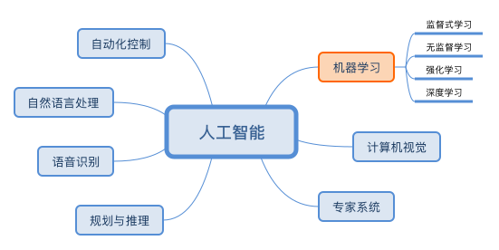

## ML(machine learning)

## 监督式学习

## 非监督式学习

## 强化学习
### 马尔科夫决策过程 Markov Decision Process

[LINK] : https://zhuanlan.zhihu.com/p/28084942

对完全可观测的环境进行描述的，也就是说观测到的状态内容完整地决定了决策的需要的特征(当前状态就可以决定未来)。

状态转移概率公式

状态转移矩阵

## 深度学习

