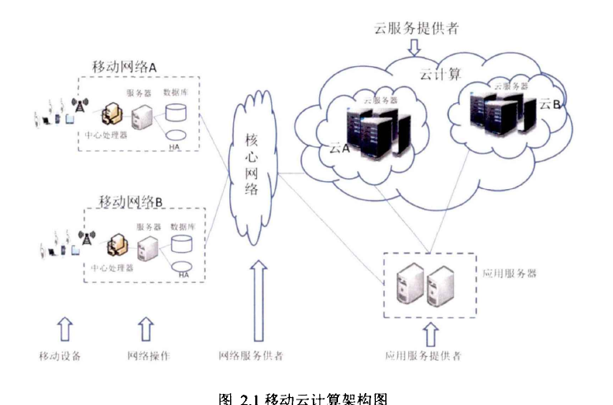
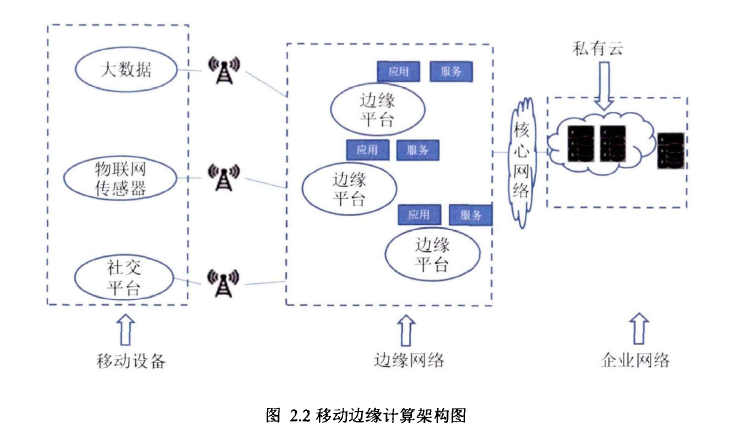
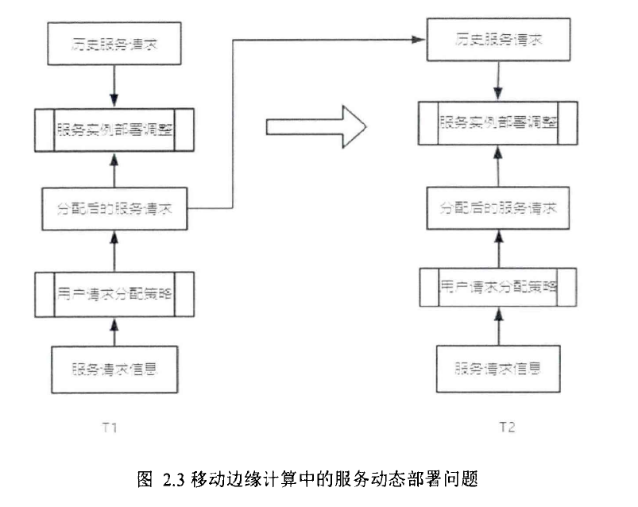
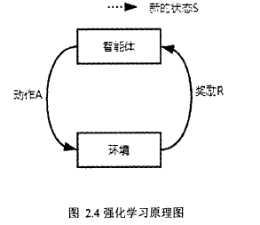
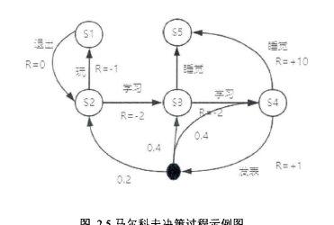
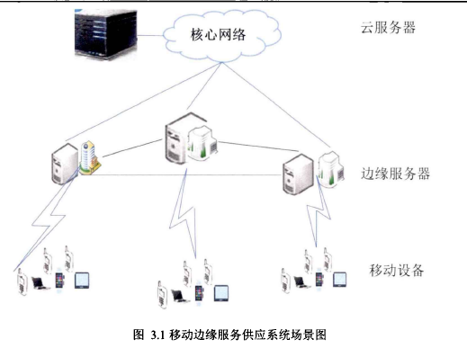
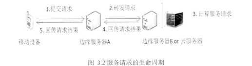

# Research on Dynamic Deployment Strategy of Edge Services Based on Deep Reinforcement Learning

## 云计算(Cloud Computing, CC)
云中可用的大量资源可以被用来为支持资源受限的终端设备提供弹性计算能力和存储能力。

SaaS

Google文件系统

MapReducel

Apache Hadoop

Apache Spark60

物联网（Internet of Things， IoT）

服务质量（Quality of Service， Qos）的关键要求

为了解决这一难题，人们通过**收集分布在网络边缘的大量空闲计算能力和存储空间**，从而产生**在移动设备上执行计算密集型和延迟关键任务的足够能力**。这种模式被称为**移动边缘计算（Mobile Edge Computing， MEC）**

通过LTE，4G或无线网络连接到它

大量的边缘服务器将以分布式方式部署，以便它们能够覆盖不同的地理区域。相邻边缘服务器的覆盖范围通常部分重叠，以避免任何边缘服务器未覆盖的空白区

作用: 
1. 考虑租用成本的情况下, 最大化边缘服务器的资源(CPU,带宽,储存器)利用率
2. 负载均衡
3. 最小化响应时间

(更强的连接)

云计算中的服务部署可以分为两个层次。
一个是物理云服务器，
另一个是服务实例，例如托管给定应用程序的虚拟机。

因为物理云服务器的数量和位置直接影响用户请求的响应时间。

M. Jia提出了两种算法，即
- 负载最重接入点优先算法(Heaviest AP Firs, HAF)根据接入点的负载对接入点进行排序，然后从负载最重的接入点到负载最轻的接入点提取k个接入点作为物理边缘云服务器的位置。HAF算法不考虑负载均衡的问题。使用这种算法，当物理边缘云服务器分配给太多的用户时，有些物理边缘云服务器的服务响应时间可能会增加，但是有些边缘云服务则会减少。
- 基于密度的聚类算法(Density Based Clustering. DBC）通过计算用户密度高的区域以决定哪个位置最适合分配物理边缘云服务器. DBC算法考虑负载平衡。因此，与HAF算法相比，它在给定用户位置给定情况下，最小化服务响应时间方面更有效。然而，移动用户经常改变他们的位置，而理边缘云服务器的位置通常是在分配之后固定的。为了解决用户移动性问题，前两种算法首先为每个不同的用户位置快照创建一组服务器的位置集合，然后通过在为不同快照创建的位置集合之间进行折衷来决定服务器的最终位置。

相反， 因此，前两种算法对于解决用户移动性问题不够灵活，因为**服务器的位置不能在任何时刻根据用户位置的分布动态地调整**。相比之下，因为边缘服务器的位置固定，根据用户位置的分布动态调整边缘服务器无法完成，所以**对边缘服务器上的服务资源**进行动态调整更具备可行性，所以进行边缘服务动态部署的研究

- **平衡好边缘服务器最大化资源利用率与终端用户的服务响应时间之间的矛盾**。

1. 减少服务响应时间作为最终目标
2. 考虑服务响应时间和服务成本，提出了双目标优化方法
3. 减少任务执行时间和降低任务执行成本是两个相互冲突的目标，它们**以一定的比例加权这两个目标**，并提出了一种在工作流中部署和调度服务的算法。这些服务部署方法各有优缺点，很少综合考虑影响服务系统性能的多个指标因素。本文在研究中同时考虑了服务之间的通信开销和部署服务的任务之间的并行性。而且，动态部署服务更接近现实，这提高了研究的复杂性。

- 监测不同时段的终端用户对服务的请求情况动态变化，边缘服务器的资源容量、覆盖范围、与终端用户的接近度等信息，将边缘服务动态部署问题建模为马尔科夫决策过程，并基于该模型提出并设计了一套服务动态部署方案，利用**云端—边缘协同体系**，通过**部署不同的服务资源配比**，提高了基于应用的性能。

边缘服务动态**部署**问题是边缘计算中的重要问题，但尚未得到很好的研究。云计算中对任务分配问题进行了很多的研究。然而，边缘计算体系结构不同于云计算，即分布式与集中式的，因此需要一种新的方法。

1. **部署问题**
2. **动态部署问题建模成马尔科夫决策过程**。首先对边缘服务动态部署问题进行了形式化描述，并定义了该问题下**强化学习中的状态，动作，奖励等重要概念**，**结合平均服务响应时间定义了代价函数**，利用**马尔科夫决策过程对边缘服务动态部署问题建模**。
3. **基于DDPG的边缘服务动态部署算法**。利用马尔科夫决策过程对边缘服务动态部署问题建模，考虑了边缘服务动态部署问题状态设置服务器上服务的资源配比的连续性，提出了一种DDPG的边缘服务动态部署算法。
4. 本文针对三种具有代表性的基准方法，利用用户对YouTube的访问数据集作为实验数据，对算法的收敛性，以及不同网络结构下的算法性能进行了实验分析。另外，针对实验数据进行了与三种基准方法的对比实验，实验结果表明本文提出的基于DDPG的边缘服务动态部署算法有效的减少了服务响应时间。

> 论文的其余部分按如下方式组织。第2章对移动边缘计算，服务部署，以及强化学习进行了介绍。第3章对边缘服务动态部署问题进行探究，主要是边缘服务供应系统的场景，问题形式化的描述，问题研究的基本假设，问题考虑的优化目标。第4章主要是利用马尔科夫决策过程对边缘服务动态部署问题建模，对提出的基于DDPG的边缘服务部署算法的详细描述。第5章主要是对边缘服务动态部署问题进行实验设计，包括实验数据准备和说明，实验参数的设置，以及实验结果分析。第6章对本文中的研究工作进行了总结，并对未来的工作方向提供了几个方向。

- 亚马逊的弹性云、微软的Azure平台、Google的App Engine和Salesforce是目前流行的一些公共云。
- 移动云计算（Mobile Cloud Computing， MCC）
- 
    

程序带给智能设备用户，还带来了范围更广的移动用户。简言之， MCC为移动用户提供云中的数据处理和存储服务。使得移动设备端不再受制于CPU速度和内存容量的限制，因为所有复杂的计算模块都可以在云端处理。移动云计算的架构

目前移动云计算还有很多的问题
1. 改善资源分配
2. 有效任务分配和卸载
3. 安全性
4. 隐私
5. 支持连续网络访问需求的云服务尤其具有挑战性。

Jin Kwok提出了云辅助的P2P媒体流**共享有限带宽**的解决方案。为了支持从云断开的操作， Huerta和Lee建议**探索相邻节点的连接以形成虚拟云**，类似地，当基于基础设施的云服务对于一些移动用户不可用时， L. Zhang提出了一种应用程序采用**多跳MANET**， 以**特定方式在合作伙伴的帮助下重新获得接入的方法**解决该问题

## 背景
1. **边缘计算推向边缘云服务**：与快速发展的数据处理速度相比，**网络的带宽已经停滞不前**。随着**越来越多的数据产生在网络边缘，数据传输速度成为云计算范式的瓶颈**。在这种情况下，为了更短的响应时间、更有效的处理和更小的网络压力，需要**在边缘处理数据**。
2. **从物联网中提取**：由于**物联网的出现将同时把设备充当数据生产者和消费者**，这意味着物联网产生的大部分数据永远不会被传输到云，而是在网络的边缘被消耗。
3. **数据生产者和消费者的改变**：在移动云计算架构中，网络边缘的移动设备通常充当数据消费者，例如，在智能手机上观看YouTube视频。然而，现在人们也在从他们的移动设备中产生数据。从数据消费者到数据生产者的变化要求在网络边缘端设置更多的功能。

欧洲电信标准化协会（European Telecommunication Standardization Institute， ETSI）

**移动边缘计算**是在**移动网络边缘提供IT服务环境和云计算能力**。旨在**网络边缘端运行边缘服务器**，使用边缘服务器处理移动设备的请求，**减少了移动设备的通信开销**。
(*电池的续航问题*); 为应用程序开发人员和内容开发人员提供**实时局域网信息（如网络负载、用户位置）**，这些实时网络信息**用于向移动用户提供上下文感知服务**，从而提高用户的满意度以及提升体验质量。移动边缘计算平台增加了边缘端责任，**允许计算任务和服务托管在边缘，这一方式为用户降低了网络时延和带宽消耗**。网络运营商可以允许第三方合作伙伴负责无线网络边缘，这将允许快速部署新的应用和边缘服务给移动用户、企业，从而为用户创造出一个低时延，高质量的网络体验。

优点
1. 低时延。对于 **密集型蜂窝网络或者是设备到设备(Device to Device, D2D)** 传输，**移动边缘计算的信息传播距离通常为几十米，一般不超过1公里**。其次，移动云计算要求信息通过几个网络，**包括无线接入网络、回程网络和因特网，其中流量控制、路由和其他网络管理操作可能导致过度延迟**。
2. 上下文敏感。移动边缘计算的一个关键特性是边缘服务器能够利用边缘设备与终端用户的接近度来**跟踪它们的实时信息**，例如**行为、位置和环境**。基于这些信息的**推断允许向终端用户提供上下文敏感的服务**。
3. 移动设备节能。 MEC作为延长物联网设备电池寿命的一个有前景的解决方案脱颖而出。
4. 增强用户的应用隐私性和安全性。对于移动云计算中**将用户数据的所有权和管理分开**，这将导致私有数据存在泄漏和丢失的问题。移动边缘计算可以避免这些问题主要具有以下原因。
   1. 由于边缘服务器分布式部署、小规模性质以及有价值的信息较少集中，所以**MEC服务器不太可能成为安全攻击的目标**。
   2. **许多MEC服务器可以是私有云，这将减轻信息泄漏的担忧**。

- 一些应用领域已经采用了边缘计算（例如，雾计算）
- 主要是增强现实（Augmented Reality， AR）领域
- 内容传递领域
  - AR通过组合同时存在的真实对象和虚拟对象来为用户提供真实环境的体验感。最近的AR应用已经适应于声音和视觉组件，例如新闻、电视节目、体育、物体识别、游戏等。然而， **AR系统通常要求任务卸载的高计算能力、保证好的体验质量的低延迟和维持可持续IT服务的高带宽**。移动边缘计算结构已经被认为是AR领域中对延迟敏感的应用程序的利器。它们增强AR系统的能力，例如通**过将智能推到网络的边缘而不是依赖核心网络来最大化吞吐量**。AR应用的一个例子是**通过检测人脑电波来工作的脑计算机交互**。该数据由EEG生物传感器接收，用于实时获取MEC和云计算平台处理的大型计算任务。
- 内容传递和缓存。边缘计算技术在**缓存HTML内容、重新组织Web布局和调整Web组件大小等网站性能优化**中起着关键作用。例如，在多个用户同时在流式视频的拥塞网络条件下，**图形分辨率降低到最小以适应避免任何拒绝服务或抖动的每个用户**。(CDN)

## 动态部署
1. 边缘服务请求接入策略，将移动设备上的服务请求接入边缘服务器端
   1. (数量和放置的位置—般是固定的)(有限的资源容量，计算能力)(一定的覆盖范围)，所以对边缘服务请求的接入主要是**根绝移动用户提交请求时的地理位置与边缘服务器的覆盖范围来决定**。
2. 边缘服务资源配比部署策略，按照部署好的资源，边缘服务器端处理用户的请求队列。(覆盖范围内的用户请求随着时段的动态变化)(不同服务请求的分布也在动态变化)**对各个时段的用户请求的历史记录信息进行学习，以便于寻找到一个有效的边缘服务资源配比部署策略**。

最终目标: 减少服务响应时间/服务成本(一定的比例加权)

T1时段到T2时段中**服务资源配比部署调整主要是根据历史请求信息和当前时段的服务请求信息**.

目前有许多研究**对服务和内容的分配和缓存**进行了研究

服务迁移问题有**很多研究采用强化学习的方法**， 

- S.Wang采用**遗传算法（GA）对服务分配问题求得近似最优解**
- M.Islam**将遗传算法与模拟退火算法相结合以进一步扩展遗传算法**。
- Y.Li提出了一种轻量级**协同缓存管理算法**，用于**最大化缓存所服务的业务量以及最小化带宽成本**
- S.Borst**将通信和服务质量由用户上下文和具体场景决定**，服务分配方案也将相应地随之进行调整，虽然这些研究可以找到近似最优的服务分配方案，但**可能落入局部最小值**。此外，**潜在的过载问题还将导致一些MEC服务器的资源使用率低，并且增加了回程负载**。
- M.Jia提出的HAF算法，根据**接入点的负载对接入点进行排序，然后从负载最重到负载最轻的接入点提取k个接入点作为物理云服务器的位置**，仿真结果表明， HAF算法在**减少云服务响应时间方面**确实比随机布局算法更有效。然而**HAF算法不考虑负载均衡的问题**。当使用该算法时，如果太多的用户分配给物理云服务器时，某些物理云服务器的服务响应时间可能会大幅度增加，然而其他物理云服务器则会减少
- DBC算法通过**计算用户密度高的区域以决定最适合分配物理云服务器的地理位置**。DBC算法考虑了**负载均衡**，在给定用户位置的情况下，最小化服务响应时间方面更有效。

- **Ksentini提出了基于一维（1—D）移动模式的马尔可夫决策过程**，通过**权衡迁移成本和用户感知质量来决定策略**
- Bokani进一步**提出了车载环境下的MDP方法**，由于网络带宽的变化，需要**基于HTTP的自适应流优化控制策略**。然而，这些研究**主要考虑具有特定成本函数的一维（1—D）移动模式**。因此， **Wang进一步考虑二维（2—D）移动模式，其中二维（2—D）移动模式的MDP问题由一维（1—D）移动模式的基于距离的MDP近似求解**
  - **仅仅考虑了单个用户的情况，没有研究多用户的多维移动模式**

然而，由于移动用户经常改变他们的位置，而物理边缘服务器的位置通常是在分配之后固定的。因此，前两种算法对于解决用户移动性问题不够灵活，因为服务器的位置不能在任何时刻根据用户位置的分布动态地调整。相比之下，对边缘服务器上的服务资源配比进行动态调整更具备可行性，所以进行边缘服务动态部署的研究是非常有必要的。

## 强化学习/激励学习/增强学习 Reinforcement Learning， RL

- 服务部署问题上目前还没有很多的研究
- 服务部署问题本质上也是一个**决策优化问题**

**让智能体在系统中不断地进行学习以获得最大的奖励，由于系统外部可以提供的信息较少，智能体必须累积自身的经历在系统中进行自我学习**。通过自我学习获取知识经验并进一步改进行动方案**以适应环境**。

关键因素
1. 状态
2. 动作
3. 环境奖励

强化学习的目的是**获得最多的累积奖励**。

强化学习算法**使用生成的数据修改自身的动作选择，然后与环境交互以生成新的数据**。并利用新的数据不断改善自身的行为，如此循环往复。

AlphaGo Zero
ATARI游戏
西洋双陆棋

强化学习的其它应用包括**文本摘要引擎、对话代理**，它们可以从用户交互中学习，并随着时间的推移而不断改进。

### 马尔科夫决策过程（Markov Decision Process， MDP）

一个可以解决大部分强化学习问题的框架。马尔科夫决策过程以**马尔可夫随机过程**为理论基础，可以用一个5组（S，A，P，R.r）来表示。
1. S是决策过程中的状态集合：
2. A是决策过程中的动作集合；
3. P是采取不同动作时状态之间的转移概率；
4. R是采取某一动作到达下一状态后的奖励值；
5. r是奖励衰减因子。

## 部署

中心化的云计算

移动边缘计算的核心思想是**将移动云计算中数据中心的一部分计算、存储等能力下沉到网络边缘**，即**靠近移动用户的位置**。移动应用产生的数据处理需求只需通过其本地网络边缘的MEC服务器进行处理并返回结果，无需通过核心网和云端的数据中心进行。这不仅大大缓解了核心网的网络压力，还能显著降低应用的网络延迟。此外，由于MEC服务器通常有其负责的服务区域，因此可以更多地与本地信息相结合。本文研究的移动边缘计算服务动态部署问题考虑的场景如图3.1所示，目的是针对移动边缘服务供应系统场景提供一个服务动态部署策略，使得满足移动用户的隐私偏好的同时，服务响应时间较低。

### 生命周期

在完成服务部署后, **移动用户发起的计算任务请求将可以由边缘服务器构成的集群承载。这些请求从产生到结束的过程**称为服务请求的生命周期，服务请求的生命周期如图3.2所示。

（１）提交服务请求：移动用户通过移动设备将服务请求相关的数据及信息通过无线网络传输至边缘服务器Ａ，边缘服务器Ａ的确定是通过边缘服务请求接入策略确定的。
（２）转发服务请求：边缘服务器Ａ明确服务请求需要的信息后，按照服务请求转发策略转发到部署有该服务的边缘服务器Ｂ或者云服务器。
（３）计算服务请求：边缘服务器Ｂ或者云服务器执行服务请求的指令。
（４）回传服务请求结果到边缘服务器：边缘服务器Ｂ或者云服务器完成服务请求的计算指令后，将计算后的输出数据传输到边缘服务器Ａ
（５）回传服务请求结果到移动设备：边缘服务器Ａ将服务请求计算后的输出数据返回给移动设备。

边缘服务请求分配策略中不仅考虑的最近邻原则，还考虑了服务器上的负载均衡

转发
高请求量的服务请求转发给另一个负载少的边缘服务器，可以有效降低用户时延。

动态部署问题描述及假设

