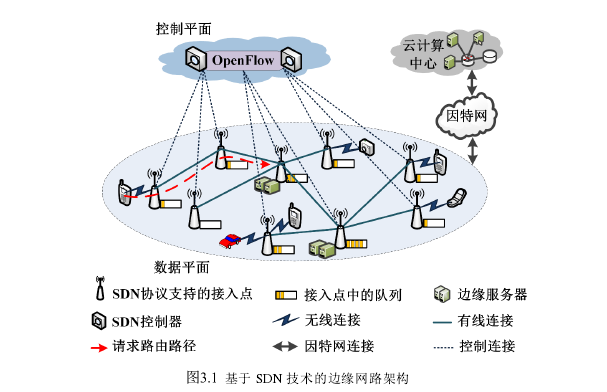

# 面向移动边缘计算的边缘服务器部署及资源分配研究

- 移动边缘计算（Mobile Edge Computing，MEC）技术
- 虚拟服务器副本（Virtual-machine Replica Copies，VRC）
- 软件定义网络（Software Defined Networking，SDN）
- 基于 枚举的最优边缘服务器部署算法（Enumeration-based Optimal Edge Server Placement Algorithm, EOESPA）
- 基于 Ranking 的近似最优边缘服务器部署算法（Ranking-based Near-Optimal Edge Server PlacementAlgorithm, R NOESPA）(YEAH)
-  K-中值聚类算法（K-medians clustering algorithm，KMCA）

## SDN(Software Defined Network) 技术

- 网络设计理念，一种推倒重来的设计思想。
- 只要网络硬件可以集中式软件管理，可编程化，控制转发层面分开，则可以认为这个网络是一个SDN网络。
- **SDN的出发点**: 下一代网络，需要可编程按需定制、集中式统一管理、动态流量监管、自动化部署等。
- **"最小化单元网络"**
  - 网线
  - 网卡
  - 协议线
- **中继器**
- **集线器(hub)** "多口中继器"

既然SDN是网络技术的前言，那学习SDN必须要懂传统的网络知识.
- 协议栈: ARP, IP, ICMP, UDP, TCP, DHCP, DNS等
- 路由技术: OSPF, ISIS, BGP, IPV6, Multicast等
- 交换技术: VLAN, Trunk, Ethechannel, VRRP等
- 标签技术: MPLS. MPLS L2VPN, MPLS L3 VPN, MPLS TE等
- 流控技术: Qos (分类标记、队列机制、拥寒避免、监管整形)
- 安全技术: IPsec VPN, SSL VPN, Firewall, IDS/IPS

建议学习以上内容的时候，参考思科、华为等网络厂商的认证课程（CCNA/HCNA等） ，按照基础到进阶到高级一点点知识累积起来。

## 边缘服务器算法布置

- 组成:
  - **数据层**: 由SDN控制器组成，并通过SDN控制协议，例如ODL和ONOS，对整个边缘网络进行实时的集中控制和资源调度。
  - **控制层**: 有大量支持SDN协议的AP构成，这些边缘网络基础设施充当SDN数据层中交换机的角色，通过应用程序接口（Application Programming Interface，API），如OpenFlow，与SDN控制器连接，接受来自SDN控制层的管理信息。

数据层
- 最小接入时延

