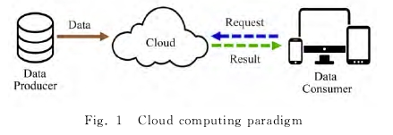
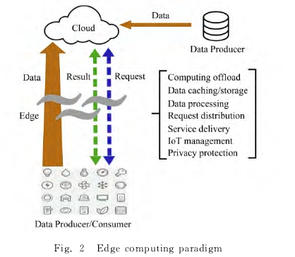

# 边缘计算：万物互联时代新型计算模型
#  Edge Ｃｏｍｐｕｔｉｎｇ　 Ａｎ　Ｅｍｅｒｇｉｎｇ　Ｃｏｍｐｕｔｉｎｇ　Ｍｏｄｅｌ　ｆｏｒ　ｔｈｅ　Ｉｎｔｅｒｎｅｔ　ｏｆ　Ｅｖｅｒｙｔｈｉｎｇ Ｅｒａ

- 该类设备所产生的数据已达到泽字节（ＺＢ）级别
表现在
1. 线性增长的集中式云计算能力无法匹配爆炸式增长的海量边缘数据；
2. 从网络边缘设备传输海量数据到云中心致使网络传输带宽的负载量急剧增加，造成较长的网络延迟；
3. 网络边缘数据涉及个人隐私，使得隐私安全问题变得尤为突出；
4. 有限电能的网络边缘设备传输数据到云中心消耗较大电能

About

