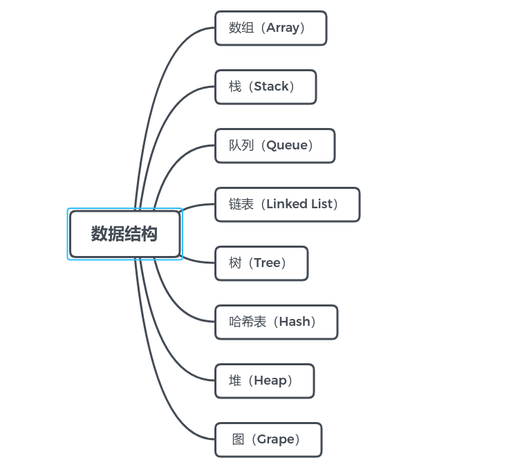

# ALGO WIKI

这里写一些感谢的链接以及各种数据结构与算法的概况

THX FOR:
- IMU
- Ncode

如上图所示, 以下总结各数据结构的优胜劣汰：

| 数据结构 | 优点 | 缺点 |
| :-----------: | :----: | :----: |
| 数组     |  插入快    |  查找慢，删除慢，大小固定，只能存储单一元素    |
|有序数组  |比无须数组查询快|插入慢，删除慢，大小固定，只能存储单一元素|
|栈       |提供后进先出的存取方式|存取其他项很慢|
|队列      |提供先进先出的存取方式插入快，删除快|存取其他项很慢|
|链表      |如果树是平衡的，则查找、插入、删除都快|查找慢|
|二叉树     |查找、删除、插入都快。树总是平衡的算法复杂|删除算法复杂|
|红黑树     |查找、删除、插入都快。树总是平衡的。类似的树对磁盘存储有效|算法复杂算法复杂|
|2-3-4树   |如果关键字已知则存取极|删除慢，如果不知道关键字存取慢，对存储空间使用不充分|
|哈希表    |快插入、删除快，对最大数据项存取快|对其他数据项存取慢|
|堆       |对现实世界建模|有些算法慢且身|

## 一、链表
### 1.1 单向链表
单向链表固然强大，但是**缺点**在于：在单链表中只能通过一个结点的引用访问其后续结点，而无法直接访问其前驱结点，要在单链表中找到某个结点的前驱结点，必须从链表的首结点出发依次向后寻找，但是需要Ο(n)时间。 

### 1.2 双向链表/循环链表
扩展单链表结点结构很简单，在单链表结点结构中新增加一个域，该域用于指向结点的直接前驱结点即可。

## TOC
- 预处理
  - 前缀最大和

