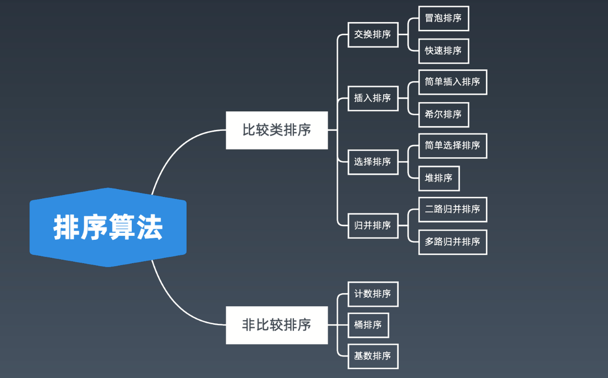
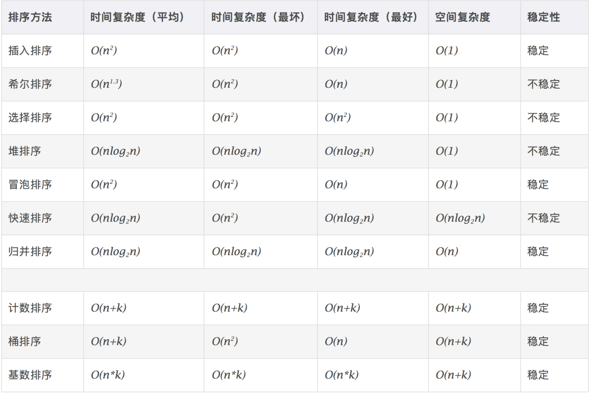

# SORT
**THX FOR:**
- [qsort()函数详解](https://www.cnblogs.com/laizhenghong2012/p/8442270.html)
- [十大经典排序算法（动图演示）](https://www.cnblogs.com/onepixel/p/7674659.html)

## STRUCT



## SWAP | 交换排序

### 冒泡
```c++
void bubbles(int p[], int m) {
	int i, j;
	for (i = 0; i < m; i++) {
		for (j = i + 1; j < m - 1; j++) {
			if (p[i] < p[j]) swap(p[i], p[j]);
		}
	}
}
```

### 快排

```c++
int* p;
void qsort(int l, int r) {
	int mid = p[(l + r) / 2];
	int i = l, j = r;
	do {
		while (p[i] < mid) i++;
		while (p[j] > mid) j--;
		if (i <= j) {
			swap(p[i], p[j]);
			i++;
			j--;
		}
	} while (i <= j);//注意等号
	if (l < j) qsort(l, j);//递归搜索左半部分
	if (i < r) qsort(i, r);//递归搜索右半部分
}
```

**拓展：**二分查找

```c++
int main() {
	int p[100], i = 0, step = 1, n;
	while (cin >> p[i]) {
		if (p[i] == 0) {
			p[i] = '\0';
			break;
		}
		i++;
	}
	int len = i, start = 0;
	sort(p, p + len);
	cin >> n;
	for (int j = 0; j < i; j++)cout << p[j] << " ";
	cout << endl;
	while (start <= len) {
		if (n == p[(start + len) / 2]) break;
		else if (n > p[(start + len) / 2]) start = (start + len) / 2 + 1;
		else if (n < p[(start + len) / 2]) len = (start + len) / 2 - 1;
		step++;
	}
	cout << (start + len) / 2 << endl << step << endl;
	return 0;
}
```


## Elect | 选择


```c++
void selections(int p[], int m) {
	int k, i, j;
	for (i = 0; i < m; i++) {
		k = i;
		for (j = i + 1; j < m - 1; j++) {
			if (p[k] > p[j]) k = j;//是p[k]而不是p[q]的原因是因为一找到比他大的就赋值，会导致最后交换的不是最大的数的后果。这样才会记录最大值。最后用于交换！！
		}
		if (k != i)swap(p[i], p[k]);
	}
}
```

## 插入

从第二个元素开始，依次比较大小，小的去前面，大的去后面，采用的方式是最低效的平移数组，针对于基本有序的数列很高效。

```c++
void InsertSort(int p[], int start, int end) {
	for (int i = start + 1; i < end; i++) {
		int temp = p[i];//相当于一个容器，将无序数列的第一个元素取出
		int j = i - 1;//作为有序数列的最后一个元素
		while (j > 0 && temp < p[j]) {
			p[j + 1] = p[j];
			j--;
		}
		p[j + 1] = temp;
	}
}
```

### 希尔（缩小增量）

作为插入排序的改进版,，先分组进行排序使得数列基本有序，再用插入排序进行排序。

```c++
void Shellsort(int p[], int len) {
	for (int i = len / 2; i < len; i /= 2) {
		for (int j = i; j < len; j++) {
			int temp = i;
			while (temp - j >= 0 && p[temp] < p[temp - j]) {
				swap(p[temp], p[temp - j]);
				temp -= i;
			}
		}
	}
}
```

## Set && 桶排

| 方法 | 效果 |
| :----: | :----: |
|   begin()    |  返回set容器的第一个元素的 地址    |
|   end()    |   返回set容器的最后一个元素 地址   |
|   clear()   |   删除set容器中的所有的元素   |
|   empty()   |   判断set容器是否为空   |
|   max_size()   |   返回set容器可能包含的元素最大个数   |
|   size()    |   返回当前set容器中的元素个数   |
|  erase(it)    |  删除迭代器指针it处元素    |
|   insert(a)    |    插入某个元素  |

## Sort

```c++
#include<algorithm>
#define sorts(p,m) sort(p,p+m);
sorts(p,m);//此处只做参考，具体使用的时候再做打算
//sort ( start , end , cmp(compare) )
//start表示要排序数组的起始地址；
//end表示数组结束地址的下一位；
//cmp用于规定排序的方法，可不填，默认升序。
```

## 优先队列——堆排（Heap Sort）

> 利用堆这种数据结构所设计的一种排序算法. 堆积是一个近似完全二叉树的结构，并同时满足堆积的性质：即子结点的键值或索引总是小于（或者大于）它的父节点. 


```c++
#include<iostream>
#include<queue>
using namespace std;
int main() {
	priority_queue<int>q;//优先队列会从大到小输出
	for (inti = 1; i <= 5; i++)q.push(i);
	for (inti = 0; i < 5; i++) {
		cout << q.top() << endl;
		q.pop();
	}
	return 0;
}
```

## 归并——分治

运用**递归化简到两两排序**和二分归并

```cpp
int a[10] = { 13 , 27 , 19 , 2 , 8 , 12 , 2 , 8 , 30 , 89 };
int b[10];
void Merge(int a[],int s,int m,int e,int tmp[]) {
	int pb = 0;
	int p1 = s, p2 = m + 1;
	while (p1 <= m && p2 <= e) {
		if (a[p1] < a[p2]) tmp[pb++] = a[p1++];
		else tmp[pb++] = a[p2++];
	}
	while (p1 <= m) tmp[pb++] = a[p1++];
	while (p2 <= e) tmp[pb++] = a[p2++];
	for (int i = 0; i < e - s + 1; i++) a[s+i] = tmp[i];
}
void MergeSort(int a[], int s, int e, int tmp[]) {
	if (s < e) {
		int m = (s + e) / 2;//向下取整得到m=s或写作 m=s + (e - s) / 2;
		MergeSort(a, s, m, tmp);
		MergeSort(a, m + 1, e, tmp);
		Merge(a, s, m, e, tmp);
	}
}
int main() {
	int size = sizeof(a) / sizeof(int);
	MergeSort(a, 0, size - 1, b);
	for (int i = 0; i < size; ++i)cout << a[i] << " ";
	return 0;
}
```

## SUMMARY




