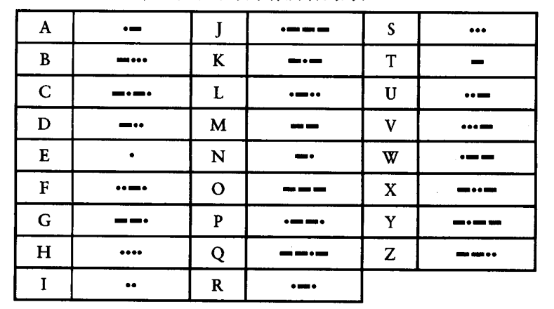
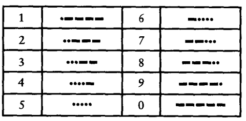
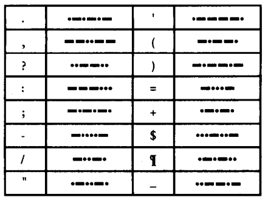
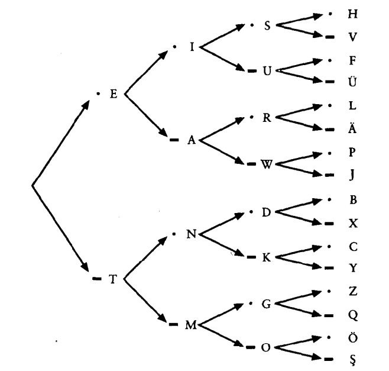

# 编码的奥妙

## 电简密谈

- morse code [1836]  CW(Continuous Wave), dot & dash, 
    
- 语言本身就是一种编码, "口头语言(语音)" <-> "书面语言(文本)"
- Braille(布莱叶盲文)
- SOS(3dots 3dash 3dots)
- number
  
- Point
  
- din & dah

- 电报机

## 编码与组合

- 10个数字和16个标点符号,26个字母

4位的编码可以加长码字至5位或更长， 5位长的码字又提供了额外的32 （2x2x2x2x2或23）个码字。一般而言，这就足够10个数字和16个标点符号使用。实际上，摩尔斯电码中的数字确实是5位的，但在许多其他编码方式中， 5位码字常用于重音字母而不是标点符号。

- binary code(二元码)
    
## 布莱叶盲文与二元编码

## 手电筒剖析
- 

## 绕过拐弯的通信

## 电报机与继电器

## 十进制记数法

## 其他进位制记数法

## 二进制数

## 逻辑与开关 

## 逻辑门电路

## 二进制加法机

## 如何实现减法

## 反馈与触发器

## 字节与十六进制

## 存储器组织

## 自动操作

## 从算盘到芯片

## 两种典型的微处理器

## ASCII码和字符映射

## 总线连接

## 操作系统

## 定点数和浮点数

## 高级语言和低级语言

## 图形化革命

