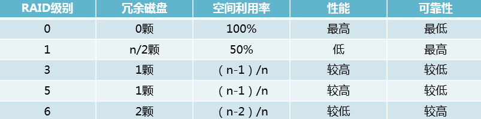

## PREFACE

内存影响开机速度和软件运行速度. 而软件必须安装在SSD中才能提高运行速度，HDD可以用来存电影和资料什么的

## 内存
临时存储数据的设备（CPU与硬盘间的桥梁）

1. **组成**: PCB板、内存条固定卡缺口（左右半圆形缺口）、内存芯片、电容、电阻、标签、SPD、金属触电（金手指——连接主板）
2. **厂家**：金士顿、威刚、海盗船
3. **参数**:
   1. 内存类型:
      1. DDR（单面金手指92个）
      2. DDR2（单面金手指120个）
      3. DDR3（金手指个数与DDR2相同  最新版）
      4. 理论上：DDR3是DDR2存储速度的两倍
   2. 内存容量（信息交换空间）: 内容越大 计算机运行速度越快
      1. 运算速度：2×2G＞1×4G（双线程）
   3. 内存工作频率（信息交换速度）: 频率越高 工作速度越快
      1. DDR3 2000
      2. DDR3 1800
      3. DDR3 1600
      4. 注意：需要主板结构支持该频率

## 主存

### 机械硬盘（HDD）

1. **结构**: 刚性磁盘片; 磁头组件（悬空于磁盘片读取数据）【忌讳碰撞】; 主轴组件; 前置控制电路
2. **参数**
   1. 容量: K M G T--1024的换算率
   2. 尺寸: 
      1. 2.5寸用于笔记本电脑
      2. 3.5寸用于台式电脑
   3. 接口类型
      1. 数据传输标准（理论值）
         1. SATA 150 M/s
         2. SATA 2.0 300M/s
         3. SATA 3.0 600M/s
         4. IDE 旧款硬盘接口
         5. 注意：接口类型版本需要低于或等于主板的SATA版本
   4. 转速和缓存: 
      1. 转速越快 处理速度越快
      2. 缓存越大 性能越优越
3. **厂商**:
   1. 西部数据（最大品牌）——收购了日立
   2. 希捷——收购了迈拓
   3. 三星

### 固态硬盘（SSD）

### 保存

量子隧穿效应导致电子从保存数据的那个地方跑出来，跑的多了就导致读不出来了. 先不说一块 9 成新盘的数据保存期远远超过 3 年，就算是已经寿命终结的 SSD 也不需要 3 个月通电一次，除非你常年住在烤箱里。

### 接口

| 接口            | 协议      | 通道(8线)     | 带宽            | 读写速度(顺序)     |
| --------------- | --------- | ------------- | --------------- | ------------------ |
| SATA 3.0        | AHCI      | SATA          | 6 Gbps          | 600 MB/s           |
| M.2 （B&M—KEY） | AHCI NVMe | SATA  PCle x2 | 6 Gbps  12 Gbps | 600 MB/s 1500 MB/s |
| M.2 (M-KEV)     | NVMe      | PCle x4       | 32 Gbps         | 4000 MB/s          |

## RAID

Redundant Arrays of Independent Disks，RAID

- RAID 0：如果你有n块磁盘，原来只能同时写一块磁盘，写满了再下一块，做了RAID 0之后，n块可以同时写，速度提升很快，但由于没有备份，可靠性很差。n最少为2。
- RAID 1：正因为RAID 0太不可靠，所以衍生出了RAID 1。如果你有n块磁盘，把其中n/2块磁盘作为镜像磁盘，在往其中一块磁盘写入数据时，也同时往另一块写数据。坏了其中一块时，镜像磁盘自动顶上，可靠性最佳，但空间利用率太低。n最少为2。
- RAID 3：为了说明白RAID 5，先说RAID 3.RAID 3是若你有n块盘，其中1块盘作为校验盘，剩余n-1块盘相当于作RAID 0同时读写，当其中一块盘坏掉时，可以通过校验码还原出坏掉盘的原始数据。这个校验方式比较特别，奇偶检验，1 XOR 0 XOR 1=0，0 XOR 1 XOR 0=1，最后的数据时校验数据，当中间缺了一个数据时，可以通过其他盘的数据和校验数据推算出来。但是这有个问题，由于n-1块盘做了RAID 0，每一次读写都要牵动所有盘来为它服务，而且万一校验盘坏掉就完蛋了。最多允许坏一块盘。n最少为3.
- RAID 5：在RAID 3的基础上有所区别，同样是相当于是1块盘的大小作为校验盘，n-1块盘的大小作为数据盘，但校验码分布在各个磁盘中，不是单独的一块磁盘，也就是分布式校验盘，这样做好处多多。最多坏一块盘。n最少为3.
- RAID 6：在RAID 5的基础上，又增加了一种校验码，和解方程似的，一种校验码一个方程，最多有两个未知数，也就是最多坏两块盘。

## 光盘
1. [常用存储介质（硬盘、光盘、NAND Flash 等）在家用环境下数据能保存多长时间？](https://www.zhihu.com/question/20623644)
2. [用蓝光刻录盘备份资料是否靠谱？](https://www.zhihu.com/question/25053181)
3. [云服务器1M带宽表示什么意思，购买服务器时如何选择服务器带宽？](https://www.zhihu.com/question/322752248)
4. [怎么看待上海电信千兆宽带的达量降速？](https://www.zhihu.com/question/267869340/answer/444540926)
5. [科普系列1：带宽和互联网的故事](https://zhuanlan.zhihu.com/p/35623474)
6. [担心固态硬盘寿命怎么办？](https://www.zhihu.com/question/265897794)
7. [硬盘忽然掉电会损坏硬盘和数据吗？](https://zhuanlan.zhihu.com/p/32907254)
8. [国外那里有便宜的大宽带服务器？](https://www.v2ex.com/t/227811)
9. [在共享网盘关闭之前用 VPS 搭建自己的私有云—Nextcloud](https://zhuanlan.zhihu.com/p/53166747) 
10. [关于最近 @clowwindy 事件的整理](https://printempw.github.io/about-clowwindy-archive/)
11. [消费级 SSD 断电保存，多久重新通电一次可以避免数据丢失？一次通电需要多久？](https://www.v2ex.com/t/394490)
12. https://www.jianshu.com/p/bf6e27f1aec7
13. [https://www.jianshu.com/p/651147329abd](https://www.jianshu.com/p/651147329abd)
