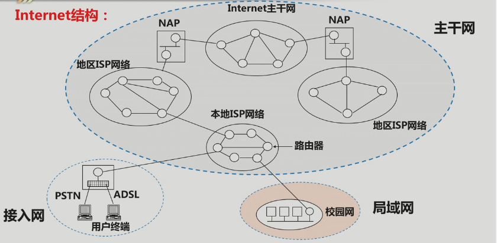
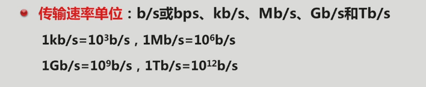

# WEB DEV
 
THX FOR:
- [少侠，请收下这份前端开发自学资料（书籍+教程）~](https://segmentfault.com/a/1190000037730709)
- [jstraining|全栈工程师培训材料](https://github.com/ruanyf/jstraining)
- [html|HTML Standard](https://github.com/whatwg/html)
s
## Preface

> 查了三个小时的英文 Wikipedia 无果，科学上网 倒腾了4个小时无果，Github CLone 奇慢,  我只想说在国内查资料的门槛太高了...... In 2020-01-15 00:00:00
>
> 这个时代的主流技术, 下个时代的预备技术.

## Internet Theory

> 弄清楚计算机是怎样连成网的
>
> 弄清楚一些核心概念和术语的含义，弄清楚它们之间的联系与区别
>
> 理论是贯穿学习始终的,  所以不一定一开始就一定要搞懂和全通

### 1.1 计算机网络

计算机网络（computer network），通常也简称网络，是指**容许节点分享资源的数字电信网络**。在电脑网络，电脑设备会透过节点之间的连接（数据链路）互相交换数据。传输介质可分为有线及无线两类——有线的可用到双绞线、光纤电缆等介质；无线则可用到Wi-Fi、NFC。
当一个设备能够与另一设备交换信息时，便可视它们俩已连接成网络，不论它们是否直连
电脑网络可依照传输介质、传输协议、 网络大小、拓扑、流量控制机制、创建目的等因素区分。**世界上最大的电脑网络为互联网**

**IP数据包** : 由于**网络的最大传输单位**会因技术而异，故在过程中**IP数据包可能需要切割成较小的数据包**，然后在目的地重组。此一方式的传输效率高，但也容易发生壅塞。IP数据包分为两部分：表头及承载数据[2]:7-6。表头包含了目的及来源地址、上层协议、存活时间等信息
**网络拓扑**:（网络的几何形状分类）。影响网络的容错度、管理方式、信息如何流通外、_网络的可靠性和架设成本_（可靠和成本呈现正相关）


- 总线拓扑：所有节点共享一个介质，以此连接其他节点。早期的以太网10BASE5及10BASE2会应用此一拓扑。
- 星状拓扑：所有节点集中连接至一个特殊的设备，例如交换器、集线器。
- 环状拓扑：所有节点以形成一个环状的方式连接，节点间需以顺序的方式发送信息。应用此一拓扑的有IBM Token Ring、IEEE 802.5 Token Ring。
- 网状拓扑：所有节点连接至一个以上的节点。
- 树状网络：所有节点一层一层地以分支形式连接。
- 混合式拓扑：将上述拓扑混合使用。在布置网络时，一般会混合多种拓扑。


**网络连接**：以太网是局域网的主流传输介质技术。以太网的标准行业规格为IEEE 802.3。以太网可以铜线或光纤电缆传输数据。无线局域网则一般会以无线电作传输介质，不过也有以红外线作传输介质的。电力线网络以既有电力线来传输数据。


- 有线网络：同轴线缆以标准10Base2及10Base5来计，其最高速度为10Mbps。光纤是一种玻璃纤维或塑胶。其以光为传递的介质。它的好处为速度快、信号难以衰减。其传输速度可超过2Gbps
- 无线网络：陆上微波通信会以地上发送站来把微波发送至类似卫星的天线接收器。陆上微波的频谱在千兆赫以内——因此所有通信限制在无阻碍的情况下才能顺利进行。基站最高可分开约40公里。通信卫星通信亦会透过微波来实现通信。该些卫星位于太空，一般距离地球地面约36000公里。其可发送语音、GPS、视频等信息。无线电与扩频技术——利用了功率较低的无线电技术的无线局域网。使用了扩频技术的无线局域网可使之间距离不远的设备互相沟通。IEEE 802.11定义了一种十分盛行的无线电技术的开放式标准——Wi-Fi。


创建一个网络还需要一些相关设备，比如**网卡**（ 电脑能够访问传输介质上的数据 ）、**中继器**（ 增强信号的网络设备 ）**集线器**、**桥接器**（ 连接两个独立的网段及过滤之间的流量 ）、**网络交换器**、**路由器**、**调制解调器**、**防火墙**（ 一种控制网络安全和访问规则的网络系统 ， 按特定规则来充许或阻止数据通过 ）

<br>

<br>

#### 互联网

互联网( Internet)是指20世纪末期兴起电脑网络与电脑网络之间所串连成的庞大网络系统。这些网络以一些标准的网络协议相连。它是由从地方到全球范围内几百万个私人、学术界、企业和政府的网络所构成，通过电子，无线和光纤网络技术等等一系列广泛的技术联系在一起。互联网承载范围广泛的信息资源和服务，例如相互关系的超文本文件，还有万维网（WWW）的应用，电子邮件，通话，以及文件共享服务。

<br>

<br>

#### Web


万维网（World Wide Web）亦作**WWW、Web**，是一个透过互联网访问的，由**许多互相链接的超文本组成的系统**。英国科学家**蒂姆·伯纳斯-李**于1989年发明了万维网。1990年他在瑞士CERN的工作期间编写了第一个网页浏览器。网页浏览器于1991年在CERN以外发行，1991年1月最先向其他研究机构发行，并于1991年8月在互联网上向公众开放。


注意：互联网并不等同万维网，**互联网是指凡是能彼此通信的设备组成的网络就叫互联网**，指利用**TCP/IP通讯协定**所创建的各种网络，是国际上最大的互联网，也称“国际互联网”。万维网是一个**由许多互相链接的超文本组成的系统**，通过互联网访问。在此定义下，万维网是互联网的一项服务。不过多数民众并不区分两者，常常混用。

**超文本以及超文本标记**

超文本（Hypertext）是一种可以显示在电脑显示器或其他电子设备的文本，**其中的文字包含有可以链接到其他字段或者文档的超链接**，**允许从当前阅读位置直接切换到超链接所指向的文字**。超文本文档**通过超链接**相互链接，超链接通常通过鼠标点击、按键设置或触屏来点阅。
（笔者这里直接认为是超链接）

超文本标记语言（HyperText Markup Language）是一种用于创建网页的标准标记语言。HTML是一种基础技术，常与CSS、JavaScript一起被众多网站用于设计网页、网页应用程序以及移动应用程序的用户界面[3]。网页浏览器可以读取HTML文件，并将其渲染成可视化网页。HTML描述了一个网站的结构语义随着线索的呈现，使之成为一种标记语言而非编程语言。

HTML元素是构建网站的基石。HTML允许嵌入图像与对象，并且可以用于创建交互式表单，它被用来结构化信息——例如标题、段落和列表等等，也可用来在一定程度上描述文档的外观和语义。HTML的语言形式为尖括号包围的HTML元素（如），浏览器使用HTML标签和脚本来诠释网页内容，但不会将它们显示在页面上。
HTML可以嵌入如JavaScript的脚本语言，它们会影响HTML网页的行为。网页浏览器也可以引用层叠样式表（CSS）来定义文本和其它元素的外观与布局。维护HTML和CSS标准的组织万维网联盟（W3C）鼓励人们使用CSS替代一些用于表现的HTML元素。

<br>

<br>

#### IP

**網際協議** （ **I**nternet **P**rotocol ） 也称**互联网协议**  是用于封包交換数据网络的一种协议。

IP是在TCP/IP协议族中网络层的主要协议，任务仅仅是根据源主机和目的主机的地址来传送数据。为此目的，IP定义了寻址方法和数据报的封装结构。第一个架构的主要版本为IPv4，目前仍然是广泛使用的互联网协议，尽管世界各地正在积极部署IPv6。

<br>

<br>

#### 端口

[参考] : https://blog.csdn.net/flying_man_/article/details/79392923

可以理解 成为黑箱的窗户 吧 : )

那么为什么要给端口[编号](http://www.so.com/s?q=编号&ie=utf-8&src=internal_wenda_recommend_textn)来区分它们呢，既然一个程序开了一个端口，那么不是[外部信息](http://www.so.com/s?q=外部信息&ie=utf-8&src=internal_wenda_recommend_textn)都可以通过这个开启的端口来访问了吗？为什么呢？

不可以,  因为数据是用端口号来通知[传输层](http://www.so.com/s?q=传输层&ie=utf-8&src=internal_wenda_recommend_textn)[协议](http://www.so.com/s?q=协议&ie=utf-8&src=internal_wenda_recommend_textn)送给哪个软件来处理的，数据是没有智慧的，如果很多的程序共用一个端口来接受数据的话，那么当外界的一个[数据包](http://www.so.com/s?q=数据包&ie=utf-8&src=internal_wenda_recommend_textn)送来后传输层就不知道该送给哪一个软件来处理，这样势必将导致混乱。


0-1023是公认端口号，即已经公认定义或为将要公认定义的软件保留的;

1024-65535是并没有公共定义的端口号，用户可以自己定义这些端口的作用。

<br>

<br>

#### DNS

Domain Name System, 

> **The Domain Name System** (**DNS**) is a [hierarchical](https://en.wikipedia.org/wiki/Hierarchy) and [decentralized](https://en.wikipedia.org/wiki/Decentralised_system) naming system for computers, services, or other resources connected to the [Internet](https://en.wikipedia.org/wiki/Internet) or a private network. It associates various information with [domain names](https://en.wikipedia.org/wiki/Domain_name) assigned to each of the participating entities. Most prominently, it translates more readily memorized domain names to the numerical [IP addresses](https://en.wikipedia.org/wiki/IP_address) needed for locating and identifying computer services and devices with the underlying [network protocols](https://en.wikipedia.org/wiki/Communication_protocol). By providing a worldwide, [distributed](https://en.wikipedia.org/wiki/Distributed_computing) [directory service](https://en.wikipedia.org/wiki/Directory_service), the Domain Name System has been an essential component of the functionality of the Internet since 1985.
>
> The domain name space consists of a [tree data structure](https://en.wikipedia.org/wiki/Tree_(data_structure)). Each node or leaf in the tree has a *label* and zero or more *resource records* (RR), which hold information associated with the domain name. The domain name itself consists of the label, concatenated with the name of its parent node on the right, separated by a dot.
>
> -- Wikipeia

TLD(N)(Top-level domain (number))

> A **top-level domain** (**TLD**) is one of the [domains](https://en.wikipedia.org/wiki/Domain_name) at the highest level in the hierarchical [Domain Name System](https://en.wikipedia.org/wiki/Domain_Name_System) of the [Internet](https://en.wikipedia.org/wiki/Internet). The top-level domain names are installed in the [root zone](https://en.wikipedia.org/wiki/DNS_root_zone) of the name space. For all domains in lower levels, it is the last part of the [domain name](https://en.wikipedia.org/wiki/Domain_name), that is, the last label of a [fully qualified domain name](https://en.wikipedia.org/wiki/Fully_qualified_domain_name). For example, in the domain name [www.example.com](https://en.wikipedia.org/wiki/Example.com), the top-level domain is [com](https://en.wikipedia.org/wiki/.com). Responsibility for management of most top-level domains is delegated to specific organizations by the Internet Corporation for Assigned Names and Numbers (ICANN), which operates the [Internet Assigned Numbers Authority](https://en.wikipedia.org/wiki/Internet_Assigned_Numbers_Authority) (IANA), and is in charge of maintaining the [DNS root zone](https://en.wikipedia.org/wiki/DNS_root_zone).
>
> -- Wikipedia

<br><br>

#### URI&URL

**URL**

> A URL is a global address of documents and protocols to retrieve resource on a computer network. URLs occur most frequently in reference to web pages (HTTP) but can also be used for database access using JDBC, email (mailto), file transfer (FTP), and many other applications. URL stands for Uniform Resource Locator.

**URI**

> A URI is a string containing characters that identify a physical or logical resource. URI follows syntax rules to ensure uniformity. Moreover, it also maintains extensibility via a hierarchical naming scheme. The full form of URI is Uniform Resource Identifier.It consists two elements:
>
> 1. **URL:** URL specifies a location on the computer network and technique for retrieving it.
> 2. **URN:** Uniform Resource Name (URN) is an internet resource that specifies URN scheme.

**URI Vs URL**

| **URL**                                                      | **URI**                                                      |
| ------------------------------------------------------------ | ------------------------------------------------------------ |
| URL stands for Uniform Resource Locator.                     | URI stands for Uniform Resource Identifier.                  |
| URL is a subset of URI that specifies where a resource is exists and the mechanism for retrieving it. | A URI is a superset of URL that identifies a resource either by URL or URN (Uniform Resource Name) or both. |
| The main aim is to get the location or address of a resource | The main aim of URI is to find a resource and differentiate it from other resources using either name or location. |
| URL is used to locate only web pages                         | Used in HTML, XML and other files XSLT (Extensible Stylesheet Language Transformations) and more. |
| The scheme must be a protocol like HTTP, FTP, HTTPS, etc.    | In URI, the scheme may be anything like a protocol, specification, name, etc. |
| Protocol information is given in the URL.                    | There is no protocol information given in URI.               |
| Example of URL: [https://google.com](https://google.com/)    | Example of URI: urn:isbn:0-486-27557-4                       |
| It contains components such as protocol, domain, path, hash, query string, etc. | It contains components like scheme, authority, path, query, fragment component, etc. |
| All URLs can be URIs                                         | Not all URIs are URLs since a URI can be a name instead of a locator. |

**Example of URI**

```shell
www.guru99.com# No protocol mentioned
what-is-sap.html# Domain not mentioned
```

**Example of URL**

```shell
https://career.guru99.com/category/heavy-industries/ # This example URL has a folder but no extension
https://www.guru99.com/what-is-sap.html# This example URL has no folder
https://career.guru99.com/top-33-investment-banking-interview-questions-answers/# This example URL has no extension
```

[Continuation] : https://www.guru99.com/url-vs-uri-difference.html

<br><br>

### 1.2 Web Server

**Web Server**

Web Server handles (解析) HTTP协议, return 一个 HTTP Response (响应) 来让浏览器可以浏览，如: 送回一个HTML页面。然而**应用程序服务器提供的是客户端应用程序可以调用(call)的方法(methods)**。确切一点，你可以说：**Web服务器专门处理HTTP请求(request)**，但是应用程序服务器是通过很多协议来为应用程序提供(serves)商业逻辑(business logic)。

Web服务器可以响应(response)一个静态页面或图片，进行页面跳转(redirect)，或者把动态响应(dynamic response)的产生委托(delegate)给一些其它的程序例如CGI脚本，JSP(JavaServer Pages)脚本，servlets，ASP(Active Server Pages)脚本，服务器端(server-side)JavaScript，或者一些其它的服务器端(server-side)技术


## 0x02 相关配置和软件


### 2.1 IIS


## INTERNET STRUCT



# 如何零基础自学Web前端开发

## 入门阶段

### 第一学期：Web开发那些事儿

#### 了解Web开发概貌

##### 了解Internet的工作原理


fixed 

###### 学习一些计算机网络的基础知识

弄清楚计算机是怎样连成网的 弄清楚一些核心概念和术语的含义，弄清楚它们之间的联系与区别

- 计算机网络、互联网、Web
- IP地址与端口
- DNS
- URI、URL

###### 了解Web Server的职责与基本使用方法

####### Web Server是干什么的？现在有哪些Web Server？

####### Web Server监听80端口，这句话是什么意思？

####### Web Server是如何管理各种Web资源的？

######## 了解相对路径与绝对路径的区别

######## 区分静态资源与动态生成的资源

######## CDN是干什么用的？

###### 了解浏览器的工作原理

（1）用户在浏览器中输入一个网址，到用户看到浏览器中出现了一个网页，这后面经历了什么样的过程？ （2）浏览器是怎样显示一个网页的？ 网页有文字，有图片，有动画，还有视频，浏览器是怎么处理它们的？

###### 浏览器与Web Server之间是如何交换信息的？

####### 信息交换的格式：JSON

####### 什么叫网络协议？有哪些常用的网络协议？

####### TCP/IP是什么东西？有什么用？

####### 系统学习与了解HTTP协议

######## HTTP的Response和Request

######### method

######### 状态码

######## HTTP消息的内部结构：Header与Body

######## MIME与ContentType

####### 学会使用Chrome开发者工具查询HTTP消息内容

##### 了解Web开发技术

###### 了解互联网的发展历程

###### 了解Web开发技术的历史演进

###### 了解当前Web前端技术栈

#### 安装与配置相关软件

##### 1 IIS

###### 安装

###### 创建网站

###### 启动和停止网站

###### 在局域网环境下访问IIS网站

##### 2 chrome

###### 开发者工具的使用

##### 3 node.js

安装Node非常容易， npm是学习的重点，一定要掌握它的几条基本命令

###### 安装Node.js本身

####### 学习用新版本，开发用老版本

####### 可以安装nvm来在同一台计算机上安装多个node.js版本，并进行方便地切换

###### 安装一些非常重要的Node.js模块

####### nodemon

##### 4 git for windows

###### Clone源码

###### Commit源码

##### 5 Visual Studio Code

###### 如何设置字体

###### 文件管理

####### 如何创建文件与文件夹？

####### 如何打开资源管理器？

####### 如何导入己有的文件？

在资源管理器中直接Copy & Paste即可。

####### Ctrl+S保存文件。

###### 使用集成终端

####### 在终端窗口中直接调用node运行.js文件

####### 提前结束程序：ctrl+c

####### 创建多个终端

###### 如何调试程序？

在调试模式设断点，单步执行。

####### Debug Console

#### 掌握HTML 5与CSS3

##### HTML基础

###### HTML的基础知识

###### 了解常用的HTML元素与属性

###### 如何引用外部资源？

注意区分一下绝对路径与相对路径

###### 网页的结构与DOM树

###### 表单与输入控件

这个东西很重要，在Web开发中非常常见！ 主要就是弄清楚action和method两个属性，以及了解清楚表单数据是如何发送到Server上的。

了解HTML表单的数据是怎样发送的？

##### CSS3精要

###### 了解CSS的基础知识

####### 版本

####### CSS的编程语言化

使用 LESS/ SASS编译工具进行预编译语法转译

####### 浏览器的兼容性问题

####### CSS命名规范-BEM

BEM是由Yandex公司推出的一套CSS命名规范， BEM是一种命名方法，能够帮助你在前端开发中实现可复用的组件和代码共享。

####### 主流的CSS方案

主流的 CSS 方案

-   跟 JS 完全解耦，靠预处理器和比如 BEM 这样的规范来保持可维护性，偏传统

-   CSS Modules，依然是 CSS，但是通过编译来避免 CSS 类名的全局冲突

-   各类 CSS-in-JS 方案，React 社区为代表，比较激进

-   Vue 的单文件组件 CSS，或是 Angular 的组件 CSS（写在装饰器里面），一种比较折中的方案

###### 学会编写CSS样式规则

###### 选择器与优先级

###### CSS样式的继承与层叠原则

CSS的顺序很重要，文件中出现位置靠后的 样式会覆盖之前的样式

##### 网页设计基础

###### 盒子模型

####### 内联元素与块元素

####### 定位与浮动

####### BFC、IFC、GFC和FFC

FC的全称是：Formatting Contexts，是W3C CSS2.1规范中的一个概念。它是页面中的一块渲染区域，并且有一套渲染规则，它决定了其子元素将如何定位，以及和其他元素的关系和相互作用。

BFC(Block Formatting Contexts)直译为"块级格式化上下文"。Block Formatting Contexts就是页面上的一个隔离的渲染区域，容器里面的子元素不会在布局上影响到外面的元素，反之也是如此。

IFC(Inline Formatting Contexts)直译为"内联格式化上下文"，IFC的line box（线框）高度由其包含行内元素中最高的实际高度计算而来（不受到竖直方向的padding/margin影响)

GFC(GridLayout Formatting Contexts)直译为"网格布局格式化上下文"，当为一个元素设置display值为grid的时候，此元素将会获得一个独立的渲染区域，我们可以通过在网格容器（grid container）上定义网格定义行（grid definition rows）和网格定义列（grid definition columns）属性各在网格项目（grid item）上定义网格行（grid row）和网格列（grid columns）为每一个网格项目（grid item）定义位置和空间。

FFC(Flex Formatting Contexts)直译为"自适应格式化上下文"，display值为flex或者inline-flex的元素将会生成自适应容器（flex container），可惜这个牛逼的属性只有谷歌和火狐支持，不过在移动端也足够了，至少safari和chrome还是OK的，毕竟这俩在移动端才是王道。

###### 响应式设计

####### flexbox响应式布局

####### 媒体查询

###### material Design

由Google提出，最初主要是针对Android手机应用开发的，后来很快地扩展到Web领域，诸如Vue和Angular等都有应用了Material Design设计原则的UI库

###### 掌握Web网页的常见布局实现方法

比如分栏、菜单、选项卡等

#### 训练JavaScript编程技能

##### 了解JavaScript的基础知识

###### 历史、版本、发展方向、应用领域......

####### Babel

可以使用Babel这个工具将采用了ES6以上版本特性的JS代码转换为ES5，以保证代码的兼容性

####### TypeScript

Typescript 也是 JavaScript ，是 JS 的超集

Typescript 能让我们写出「强类型」的 JS，从而减少运行时的错误。

###### JavaScript的开发与运行环境

学习JavaScript编程，早期主要使用普通文本编辑器+浏览器，现在推荐使用VS code编写代码，在Node.js环境中运行。

####### 浏览器

####### Node.js

##### 掌握JavaScript的基础语法与常用对象

###### 变量、常量与数据类型

####### let、const和var

####### 基础类型与引用类型

####### 类型转换

####### null和undefined

####### 变量的作用域

###### 输入与输出

####### 浏览器中使用document.write，console实现

###### 运算符与表达式

####### ES6新增：展开运算符

####### 优先级

###### 流程控制

####### 条件语句

####### 循环语句

######## ES6新增：for-of循环

###### 字符串操作

####### templateString

####### 正则表达式

###### 数组操作

####### 定义

####### 访问

####### 插入与删除

####### 排序

####### 查找

###### 解构赋值

###### settime，setinterval

（1）使用settimeout延时输出信息 （2）使用setinterval定时输出信息，之后中止 （3）timer.js，一个模拟后台工作进程的示例

##### 函数

###### 函数的定义与调用方法

####### 命名函数与匿名函数

####### 函数的返回值

返回函数的函数

####### 函数的参数

形参与实参的区别 参数个数可变 默认函数参数 保存参数的arguments对象 作为另一个函数参数的函数对象

####### 函数作用域

####### 嵌套定义的函数

在一个函数内部又定义一个函数

###### 递归调用

###### 箭头函数

###### this关键字与call和apply方法

##### 对象

###### 对象的定义与使用方法

####### 定义空对象之后再添加成员

####### 对象字面量

####### 嵌套的对象定义

####### 定义对象方法

####### 对象的属性的遍历、添加与删除

####### 对象作为函数参数

####### 对象的复制：浅拷贝与深拷贝

###### 对象工厂函数与构造函数、new关键字

###### 类与继承

####### class关键字

####### extends关键字

####### 属性的概念

####### ES6 对象方法简化定义

##### JSON

###### Json字符串与JavaScript对象之间的相互转换

JSON.parse()

###### Json的基本语法

##### JavaScript模块化规范

前端的模块管理器一般指管理 AMD 或者 CommonJS 模块的东西。

我们有很多方式来描述 JS 中多个库或类的交互方式，比如 exports 和 requires。你可以按照 AMD 或者 CommonJS 的 API 来书写 JS，然后用 Browserify 将它们打包。

非常重要，Vue和React的各种组件，都是使用ES6的模块语法。 Node.js的模块，暂时还不能直接使用。

主要有两种模块： 一种是ES6中的模块，这是未来的方向，主要使用export和import 另一种是Node.js主流版本所使用的模块，主要使用export和require 当前，这两种都是需要掌握的。

新的浏览器支持ES6的模块，但Node 8不支持。 类似于组件化开发（CBD）概念

方法是： 使用

```{=html}
<script type="module">
```

实现

注意： 与Node.js模块相区分。

###### CommonJS

Node.js支持这种规范

###### AMD

AMD ( https://en.wikipedia.org/wiki/ Asynchronous\_ module\_ definition ）也是一种JavaScript 模块化规范，与CommonJS 最大的不同在于，它采用了异步的方式去加载依赖的模块。AMD 规范主要用于解决针对浏览器环境的模块化问题，最具代表性的实现是requirejs (http:// requirejs. org ） 。

其编码方式类似于AngularJS

###### ES6模块化

代表未来的发展方向，将一统天下

##### 闭包

###### 函数执行上下文与this关键字

####### 函数对象的call方法

####### 函数对象的apply()方法

###### 闭包与返回函数的函数

##### 原型

###### 原型（prototype）是什么？

###### 通过原型构建对象

##### 迭代器与生成器

迭代器用于以一致的方式访问数组和集合。 它提供了一个next()方法用于获取集合中的"下一个"元素，又有一个done属性来告诉外界，集合中还有没有元素可以读取。 ES6中的for-of循环，就用到了这个特性。

生成器则是一种特殊的函数，它返回一个迭代器。 定义生成器需要使用"\*"和yield关键字。 当程序执行完一个yield代码时，会暂停，直到next()被调用，才会继续执行。

生成器多用于异步代码，一些第三方的库，比如Koa，就用到了这个特性。

##### JavaScript异步编程语法特性

###### 同步与异步的概念

###### 回调

####### 什么是回调？怎样编写一个支持回调的函数？

####### 回调地狱：多重嵌套的回调

###### Promise

###### async/await

#### 使用JavaScript操控网页

##### 了解浏览器的工作原理

##### BOM：与浏览器交互

##### DOM：与HTML文档交互

###### 访问和操控DOM元素

###### 响应事件

有两种事件类型：冒泡、捕获 另外要注意一下，如何取消表单提交按钮的默认事件

##### AJAX：与服务端交互

###### XMLHttpRequest

###### jQuery

###### Fetch API

Fetch API是一种由浏览器直接支持的新的编程接口，可用于取代远古时代的XMLHttpRequest，后面要介绍的PWA技术中的核心对象，ServiceWorker，也使用它。Fetch API用到了Promise对象，所以在学习它之前，要先学习JavaScript异步编程模型。 由于Fetch技术很新，还没有成熟，所以虽然从长远来看它很重要，但当前却是选学的内容。

#### 经典前端开发框架

##### Bootstrap

注意它引入的jQuery是slim的 注意一些样式变化：display-4

###### 安装与版本对比

###### 样式库

###### 网格系统

###### 组件

##### jQuery

###### jQuery简介

###### 操控DOM

###### 发出AJAX请求

学习顺序： （1）HTTP请求与响应的基础知识 （2）JavaScript如何使用XMLHttpRequest发出AJAX请求并且接收响应 （3）jQuery发出AJAX请求、接收响应的基本方法

###### 使用jQuery插件

#### 期末考试：使用Bootstrap/jQuery开发一个小网站，部署到IIS上

### 第二学期：掌握Node.js开发技术

#### Node.js基础开发技术

##### Node开发基础

###### node概述

Node是什么 它有哪些组成部分

####### V8引擎，C++与JS混合开发而成

####### 了解Node编程的主要特性

######## 异步执行

######## 事件驱动

######## 单线程

####### 什么叫同构JavaScript？

前后端使用同一种语言，会带来许多方便。比如一些库可以重用，一些数据结构也可以不用在不同的语言之间进行翻译。

###### 学会使用Node

####### 安装Node

node -v 进行验证

####### node命令，学会使用Node交互式编程环境

####### 知道怎样使用Node运行独立的js文件

####### 学会使用NPM

######## 怎样安装新软件包？

######## 如何创建package.json？

使用npm init创建package.json

######## 怎样运行脚本？

用npm run script-name 可以运行任何脚本

####### Node.js项目

######## 熟练掌握使用Visual Studio Code创建一个Node项目的方法

######## 学会使用nodemon

安装nodemon，监控文件变化，自动重启node应用

######## 了解Node.js项目构成

###### 补充知识

cnpm 镜像站点问题

####### 有一个可选的yarn，功能与npm等价，可以选学

####### 可以使用国内镜像来提升安装模块的速度：cnpm

##### 学习JavaScript的模块化部分

##### Node组件化开发

Node.js模块基本使用方法：使用require导入外部模块

###### 掌握node.js核心模块的基本用法

不需要单独安装的模块，称为core modules

Node.js官方提供了一些常用的模块，这些模块包括：fs,path,assert,os,net,dns,http等等

不需要全部都学，用到的时候再选学

###### 依据自己需要，选学选用第三方模块

使用npm install安装 注意以下参数的功能： -g -save -save-dev

安装完的模块放在node-modules文件夹中，其信息记载于package.json中

使用npm rm删除己安装的第三方模块

####### underscore

一个用于操作集合和字符串的JavaScript库

####### node-dev

与nodemon很类似，不同之处在于： In contrast to tools like supervisor or nodemon it doesn't scan the filesystem for files to be watched. Instead it hooks into Node's require() function to watch only the files that have been actually required.

https://www.npmjs.com/package/node-dev

####### jshint

jshint app.js 检查代码中是否有写得不规范的地方 /\* jshint esnext:true \*/

####### httpster

用于构建一个提供静态文件服务的功能 https://www.npmjs.com/package/httpster

httpster -p 8080 -d /home/somedir/public_html

####### commander.js

commander. js是一个实现命令行交互的 Node. js模块，由著名的工程师 TJ Holowaychuk编写。

###### 搭积木的游戏：学会基于模块构建Node.js应用

##### 学JavaScript部分的异步编程部分

##### Node.js事件驱动编程模型：事件监听器与事件发射器

使用events模块中的EventEmitter对象。 也可以自定义一个类，派生自EventEmitter，这样它就具备了事件驱动特性

这是一个极为重要的编程模式，主要通过回调来实现的。

##### Node.js的文件操作

通过读写文件，掌握异步编程模式

从callback起步，有一个deepCallback.js示例，展示一个很深的嵌套，每完成一步，beep beep两声。这个可作为学生作业。

大体上可分为同步和异步两大类

###### 文件的同步与异步存取模式

###### 流与管道

###### 使用fs.Stats读取文件信息

###### 文件夹操作

####### 创建、删除文件夹

####### 改名

####### 查找文件

####### 使用File System Watcher监控文件系统的变化

##### 期中考试

使用Node.js核心模块开发网络应用程序

###### 找本《计算机网络》教程，学学TCP/IP协议相关的知识

###### 试题一：Socket编程------实现TCP Server

导入net模块，掌握Socket编程的基本技巧

####### 了解一下Socket的概念与编程模型

####### 搜集相关资源，学习Node.js所提供的net核心模块的用法

####### 自己总结Node.js的Socket基本编程套路

基本编程模式： res.writeHead() res.write() res.end();

####### 学以致用：编写一个网络计算器

开两个终端窗口，一个跑网络计算器Server端应用，另一个跑客户端应用。 客户端输入：1+1 服务端计算后将结果回传给客户端： 1+1=2

###### 看《HTTP权威指南》，了解HTTP协议的具体细节

###### 试题二：开发HTTP Server

导入http模块，创建简单Server，相关组件触发的相应事件，回调的编程技巧

http.createServer() （1）响应"/"，发回"index.html" （2）找不到文件，发回404响应 （3）响应\*.jpg，发回图片 （4）响应CSS （5）响应favorite.ico

不理解Server的工作原理，HTTP协议，文件操作，是不可能掌握这个技术的。

####### 搜索相关资源，学习Node.js所提供的相关核心模块的用法

######## fs

######## http

####### 编写HTTP Server，使用浏览器发出请求，检测其工作是否正常

#### Web开发极简框架：Express

它的下一代框架是Koa，能更自然地编写异步代码。学习它需要先学会ES6中的async函数、迭代器与生成器特性。

##### 什么是Express?

###### Express与Node.js之间是什么关系？

###### Express的应用场景是什么？

###### Express生态系统简介

###### 下一代Express------Koa

##### 安装Express

##### 使用Express中间件

###### 中间件是什么东西？

###### 数据如何在中间件之间传送？

上下文数据一般保存在请求对象上，比如用户被存储为req.user，后续的中间件和路由可以用这个属性访问它。

###### 怎样定义中间件？

###### 如何组合多个中间件构建一个HTTP请求处理管线

与ASP.NET core几乎完全一致。

##### 单元测试一：使用express重构HTTP Server

用它来重写原先使用http模块编写的Web Server

##### 学会构建Node.js Web应用路由系统

###### 怎样响应get/post等HTTP请求？

###### 路径参数怎样用？

###### 如何从URL中提取查询字符串？

###### 学会使用正则表达式匹配路由

###### 学会使用静态资源中间件提供静态文件访问

###### 怎样实现重定向？

###### 不同的URL，转发给不同的中间件处理

##### 构建RESTful Service

###### 了解RESTful Service的基础知识

####### 什么是REST？

####### 怎样设计REST API？

###### 掌握REST开发辅助工具的用法：Postman，Fiddler等，任选其一

###### 学会使用Express实现RESTful Service

##### 使用视图引擎

###### EJS

###### Pug

###### Handlebars

###### Mustache

###### ......

##### 单元测试二：分析express-generator创建的"样板"项目

#### 期末考试 构建实时Web应用------在线聊天室

##### 急用现学

###### 学习JavaScript中AJAX部分的知识

###### 学习jQuery中AJAX部分的知识

###### 学会使用jQuery访问Express开发出来的RESTful Service应用

##### 自行收集资料，了解开发实时应用的基础知识

###### WebSocket是什么

###### Socket.io

##### 编写小的Demo，进行实时应用的开发实践

###### 在Node.js应用中使用WebSocket

npm install ws npm install wscat -g

###### Socket.io的使用方法

它可以看成是一个完整的基于WebSocket的技术解决方案，比如，它可以在发现浏览器版本较老时，自动"回退"到使用较老的技术实现实时通讯

##### 使用Socket.io实现聊天室的实时通讯功能，并将其封装为RESTful Service

##### 使用Bootstrap/Server端视图引擎构建网站的UI界面，使用jQuery发出AJAX请求访问RESTful Service

##### 部署

###### 部署到Windows服务器上

关闭IIS，直接运行Node.js，监听80端口

###### 将网站部署到Linux服务器上

####### 使用VirtualBox安装Linux服务器，学习Linux的基础知识

####### 将网站部署到Linux服务器上（直接运行Node.js，监听80端口）

###### 测试程序是否工作正常

### 第三学期：数据存取技术学习要点

#### 学习数据库的基础知识

##### 什么是数据库？

##### 有哪些数据库？如何分类的？各有哪些特点？

#### 学习如何存取关系型数据库

##### 学会编写SQL命令

##### 使用MySQL存储数据

###### 数据库的安装与配置

###### 掌握Node.js存取MySQL的基本编程技巧

#### 学习如何存取NoSQL数据库

##### 使用MongoDB存储数据

###### MongoDB概述

####### SQL vs. NoSQL

####### MongoDB的优缺点

###### 掌握MongoDB的基础知识

####### 安装与配置方法

####### 理解文档与集合的概念

####### ......

###### 使用MongoDB Shell熟悉与掌握MongoDB

####### 管理数据库

####### 管理集合

####### CRUD基本操作

####### ......

###### 学会使用Robo 3T访问MongoDB

###### Node.js应用直连MongoDB

####### 添加驱动

####### 连接MongoDB

####### 了解编程模型

####### 数据库操作

####### 集合操作

####### CRUD操作

###### Mongoose：简化MongoDB存取的数据框架

####### 了解Mongoose

####### 利用Mongoose连接数据库

####### 定义模式

####### 实现CRUD

##### 使用Redis存储数据

#### 期末考试

##### 重构------在线聊天室的数据存储功能实现

##### 使用己经掌握的知识自己开发一个小网站，使用数据库存储数据

### 第四学期：使用Vue开发前端应用

#### Vue技术精要

##### 基础入门

###### Vue概述

####### Vue是什么

######## MVVM设计模式

######## Vue vs. jQuery

####### 了解Vue的特色与优势

###### Vue的安装与使用

####### 下载与使用方法

####### 学习Vue的工具

####### Vue CLI：Command Line Interface

vue init webpack my-project

####### Vue的Chrome插件

###### Vue的实例

####### Vue实例中的基础成员及作用

######## methods

######## data

data中定义的属性，可以通过Vue实例直接访问。

######## el：挂载点

######## template：模板

######## 侦听属性

watch 一个典型的实例就是购物车 deep属性。

######## 计算属性

computed Cached属性 getter和setter

######## this

注意一下在Vue实例内部和组件内部，this到底引用哪个对象。

####### Vue的生命周期

Vue官方文档中有一张图，讲得很详细

###### 模板与数据绑定

数据更改时，UI会自动更新

####### 设计Vue.js模板

######## 基本实现思路

主要就是 输入控件：v-model 显示控件：v-bind 配合v-if和v-for

######## 绑定显示文本

######### 了解Vue常用指令的用法

########## {{ }}绑定和v-text绑定显示文本

########## v-html绑定HTML代码

########## v-bind绑定到HTML元素属性

v-bind:type v-bind:disabled

可以简写掉前面的v-bind

`<a v-bind:href="url">`{=html}...`</a>`{=html}

########## v-once绑定

########## v-for与v-if混用

v-for优先，每轮循环中再检测条件是否满足

########## v-cloak

######### 其他相关技术特性

########## 数据绑定表达式

########## 过滤器

######### 显示特定类型的数据

########## 数组操作与自动更新显示

Vue 包含一组观察数组的方法，它们将会触发视图更新。这些方法如下：

    push()
    pop()
    shift()
    unshift()
    splice()
    sort()
    reverse()

########## 显示对象属性

######## 绑定到CSS

######### 绑定到HTML元素的style属性

######### HTML元素绑定CSS样式类

######### 如何动态切换显示HTML元素样式？

####### 事件响应

极为重要

######## v-on与事件的modifier

```{=html}
<form v-on:submit.prevent="onSubmit">...</form>
```

.lazy .number .trim

.native

######## 响应鼠标与键盘事件

######## 自定义事件

####### 表单绑定

使用v-model实现双向绑定

###### 组件开发

####### 组件概述

组件是一个可以复用的Vue实例

####### 组件的定义与注册方法

######## 两种类型的组件

######### 单文件组件

######### 放在网页中的组件

######## 组件的注册

######### 网页中定义的组件

########## 全局注册

Vue.component()

########## 局部注册

使用Vue实例的components选项， 注册后的组件只有在该实例作用域下有效

######## 组件可以嵌套

组件中也可以使用components 选项来注册组件，使组件可以嵌套。

######## 了解组件定义需要遵循的一些原则

注意一下命名方法：驼峰命名（camelCase ）和短横分隔命名C kebab-case ）

组件的data属性应该是一个函数，返回一个独立的数据对象，以保证各个组件之间的状态不会互相影响。

####### 组件之间的数据通讯

######## 父组件通过 props 向子组件传递数据

通过props 传递数据是单向的

推荐对外部传入props中的数据进行数据验证，如果发现传入的数据不符合预期，在控制台弹出警告。

######## 子组件通过事件向父级组件发送消息

子组件调用\$emit触发事件 父组件使用v-on响应之。

特别地，子组件\$emit('input',...)，就可以在子组件使用时加上v-model绑定到父组件的相关属性上，直接改变其值。

######## 父子组件之间的直接访问

######### \$ref

可以在使用子组件时给它的ref属性赋值： \<component-a ref= " comA " \>\</ component-a \> 然后父组件就可通过这个名字找到它： var comA = this.\$refs.comA;

######### $parent和$children

在子组件中，使用this.$parent 可以直接访问该组件的父实例或组件，父组件也可以通过 this.$children 访问它所有的子组件，而且可以递归向上或向下无线访问， 直到根实例或最内层的组 件

######## 中央事件总线实现任何组件间的通讯

定义一个空的Vue实例，用于中转。 var bus= new Vue ();

任何一个组件，都可以调用bus.$emit()发出事件。 也可使用bus.$on()响应某个事件。

用这种方式，可以实现父子、兄弟、跨级组件之间的数据交换。

######## 通过插槽（slot）分发内容

`<slot>`{=html}

在子组件内使用特殊的＜slot\>元素就可以为这个子组件开启一个slot（插槽），在父组件模板 里，插入在子组件标签内的所有内容将替代子组件的`<slot>`{=html} 标签及它的内容。

使用this.\$slots可以访问插槽

######### 单slot

组件内只定义了一个`<slot>`{=html}

######### 具名slot

给`<slot>`{=html} 元素指定一个name 后可以分发多个内容，具名slot可以与单个slot共存

####### 组件高级用法

用得不多，了解即可。

######## 递归组件

组件在它的模板内递归地调用自己，只要有一个结束条件就行了。

######## 内联模板

在使用组件时，给组件标签使用inline- mplate 特性，组件就会把它的内容当作模板，而不是把它当内容分 发

######## 动态组件

Vue.js 提供了一个特殊的元素＜component\> 用来动态地挂载不同的组件， 使用is 特性来选择 要挂载的组件。

######## 异步组件

Vue.js 允许将组件定义为一个工厂函数，动态地解析组件。 Vue. 只在组件需要渲染时触发工厂函数， 并且把结果缓存起来，用于后面的再次渲染。

###### Webpack基础

####### 概述

######## 什么是构建？

构建工具解决的其实是几方面的问题：

-   任务的自动化

-   开发体验和效率（新的语言功能，语法糖，hot reload 等等）

-   部署相关的需求

-   编译时优化

######## 什么是Webpack

######## webpack与grunt,gulp等有哪些区别？优缺点如何？

grunt和gulp都是以"任务（task）自动化执行"为中心的，但人们后来发现其实使用Npm Script也够用了。

webpack + npm script是主要的开发方式

####### 使用Vue-CLI创建项目框架

####### 单文件组件

以.vue结尾，包容HTML、JS和CSS

###### 单元测试一：使用Vue重构在线聊天室应用的UI层

##### 进阶与实践

###### 访问Web Server：axios

###### 路由系统：vue-router

####### 使用路径参数实现动态路由

####### 嵌套路由

####### 路由之后提取数据

###### 状态管理：vuex

###### 自定义指令

全局注册 Vue.directive（） 或者是 new Vue()( { directives:{ } } )

###### Vue应用部署

https://www.zhihu.com/question/20790576 《大公司里怎样开发和部署前端代码？》

在部署时，会出现很多问题的： 比如大文件需要拆分，小的资源可以内联等等，人工去做，很可怕的！

####### 使用Vue CLI编译打包

####### 部署到Node.js web App中

###### 单元测试二：将在线聊天室改造重构为"前后端分离"的Web应用

#### 期末考试

##### 用Vue写一个ToDoList应用

## 二、实战阶段

学习技术的目的，就是为了"实战"，不能实战的技术，学之无用。

### 实战选题

#### 用node.js+Vue搭建一个百度网盘应用

#### 克隆iconfont，一个极佳的用Vue构建UI层的项目

#### 克隆知乎，写一个在线问答网站

#### 写一个网上电子书店网站

#### ...

### 开发你的第一个"传世之作"

#### 1 需求分析

##### 列出功能清单

##### 明确网站用户类型，分配权限

#### 2 UI设计

##### 网站结构设计

###### 确定网页间的链接（路由关系）

###### 文件夹结构

不同的脚手架，通常会有不同的文件夹结构，并且特定的文件夹往往负责保存特定的文件，拥有特定的职责。 你需要遵循相应脚手架的约定。

比如，React通常会为每个组件创建一个文件夹，里面放置一个index.js保存组件的源代码。这样在需要的时候就可以import进来了。

##### 网页可视化效果设计

##### 资源与素材收集与制作

区分全局还是局部的资源。 比如全局样式，全局字体，全局图标等 哪些资源需要被Webpack所处理，注入到网页中......

##### UI框架选型

bootstrap-vue , vue-material，element UI，Mint UI等

#### 3 架构设计

##### 分层的系统架构

###### 使用Vue开发的Web前端应用

###### 使用Node.js+Express开发的后端应用

####### 服务层

####### 业务逻辑层

####### 数据存储层

##### Client与Server之间的信息交换

###### 确定要交换的数据包容哪些具体的数据项

###### Server端RESTful API设计

##### 选择数据库，确定数据存储结构

###### 选MongoDB还是MySQL？

###### 数据库中具体包容哪些东西？

##### 组件切分

###### 前端Vue组件设计

####### 外观样式

####### 状态保存

####### 交互特性

######## 与人操作的交互

######## 组件间的交互

######## 与Server端的交互

###### 后端Node模块

####### 确定每个模块的职责与功能

####### 确定模块之间的依赖关系

####### 寻找可以复用的"轮子"

####### 确定要自己开发模块清单

##### 确定异常处理策略

#### 4 项目框架搭建

##### 使用Vue-cli搭建Web前端项目框架，并配置好开发环境

##### 构建Node.js后端项目框架，并配置好开发环境

#### 5 组件化开发

##### 一个一个地开发前端组件

##### 前端组件集成

###### 将Vue组件装配为前端页面

###### 实现前端组件之间的路由

##### 一个一个地开发后端Node模块

#### 6 准备发布项目

##### 后端组件集成与功能测试

###### 通过路由和中间件管线将Node模块组合起来

###### 进行必要的测试

当前可以采用手工测试 以后学了单元测试等技术之后，采用自动化测试

##### 前端界面美化

###### 实现动画与交互特性

经常要用到样式切换来实现

###### 调整样式表，使界面美观

#### 7 部署

##### 在本机上部署和测试

###### 使用VirtualBox安装Linux虚拟机

###### 在Linux虚拟机上安装Node.js与数据库（MongoDB或MySQL）

###### 将开发好的前后端应用合并在一起，部署到Linux服务器上

##### 部署到真实Web Server

###### 在阿里云上购买Linux服务器

###### 在Linux服务器上部署网站

两种方式： 一种是直接让Node.js监听80或443端口， 另一种是使用Ngix之类反向代理进行转发。

## 三、进阶阶段

### "玩转Vue"

#### 深入理解Web前端框架（Vue）运行机理

##### Virtual DOM与Render函数

##### 异步更新DOM 的原理

Vue 在观察到数据变化时并不是直接更新DOM，而是开启一个队列，并缓冲在同一事件循环 中发生的所有数据改变。在缓冲时会去除重复数据，从而避免不必要的计算和DOM 操作。然后， 在下一个事件循环tick 中， Vue 刷新队列井执行实际（己去重的）工作。所以如果你用一个for 循 环来动态改变数据100•次，其实它只会应用最后一次改变，如果没有这种机制， DOM 就要重绘100 次，这是一个很大的开销。

##### 状态管理的方式

###### 全局状态

###### 组件状态

##### 路由

本质上就是把URL映射到组件

#### 服务端渲染与同构应用

SSR（ Server Side Render，服务器端渲染） 前提是本地服务器与线上服务器使用相同的编程语言。

#### ......

### 掌握系统性能调优方法

尤大大推荐的在知乎上的回答， https://www.zhihu.com/question/20790576

#### 优化Node.js后端应用

##### 了解Node.js的内部机理

事件循环 线程模型

##### 掌握PM2的用法

#### 了解浏览器渲染原理

#### Web前端性能优化策略与解决方案

### Web前端工程化相关技术

#### 前端工程化概述

##### 了解和掌握各种前端工具

目前市场上流行的前端工具大体分为以下几类，分别介绍如下。 1.工作流管理工具，比如 Grunt、 Gulp。 2.构建工具，比如 webpack、 rollup。 3.整体解决方案，比如 FIS（百度）、 WeFlow。 4.脚手架工具：Yeoman

目前有很多编辑器如Webstorm 、VS Code 等已经集成了各种检查工具，编辑器会 将检查工具输出的错误实时地显示到编辑的源码上。通过编辑器集成后，不用通过命令行的 方式去定位错误。

webpack也提供了相应的loader。

###### 代码检查：ESLint

###### Browserify

是一个工具，用来将 CommonJS 形式的 JS 文件打包起来，放到浏览器里运行。用 npm 仓库的人发明了 CommonJS。

Browserify己经被Webpack搞翻了

###### Uglify

###### CSS

####### 预处理：LESS

####### 后处理：SCSS

这些东西还是被广泛使用的。

####### 样式代码检查：Stylelint

###### 工作流管理工具

多数场景，可以用Npm Script完成。

####### Grunt

####### Gulp

###### 代码转换：Babel

###### 脚手架工具：Yeoman

###### ......

##### 单元测试与TDD（测试驱动开发）方式

最初时可以不学，在工作时需要补上

###### Java测试框架

####### Jasmine

####### Mocha

####### ......

###### Mock与前后端连调

###### ......

##### 掌握团队协作开发项目所需的职业技能

###### 使用Git管理项目

###### 持续集成与自动化构建

###### ......

#### 系统学习Webpack

在初期阶段，可以直接使用脚手架工具而不需要过多地与webpack打交道，但到了后期，则必须与webpack打交道了。

##### 什么是Webpack？为什么它有"一统江湖"的势头？

##### 理解Webpack的工作原理

###### chunk

###### loader

###### plugin

##### 学会灵活配置Webpack

##### 了解其插件系统，学会使用各种插件

##### 掌握Webpack的定制与扩展技术

###### 开发新插件

###### 集成新工具

###### ......

## 四、拓展阶段

### 在己有根据地基础上向外"蚕食"

#### 对比学习其他的Web前端开发框架

##### 学React

###### 组件化开发

###### 状态管理

####### Redux

这个有两块内容：

一个是使用原生的Redux进行开发，主要就是弄清楚Redux的几个核心对象的职责与协作关系。

另一个则是相关的开源辅助框架，具体到React，就是react-redux，它里面提供了Provider等手段简化Redux的开发。

对于上层的框架，要想学好，通常需要了解它所直接封装的那一层的功能

###### 路由

###### UI设计：Ant Design

###### ......

##### 学Angular

#### 学习微信小程序开发

#### 学习离线应用的开发技术------PWA

##### Push Notification

##### Offline Accessibility

##### Background Sync

##### Install on Home Screen

##### Access Device Camera

##### Get User Location

#### 纵向拓展，学习Web后端开发技术

##### 学习其他平台的Web后端技术

比如Java和Python Web开发技术

##### 拓展：Docker与微服务

### 进入全新的领域（按需学习，长期投资）

#### 开发桌面应用：Electron

#### 开发手机应用：React Native

#### AR眼镜等智能设备应用开发：React 360

#### "混血的"Web应用：WebAssembly技术


## [Progressive Web App(PWA)](https://juejin.im/post/6844903556470816781)


4G 宽带码分多址 -Wideband Code Division Multiple Access，常简写为W-CDMA